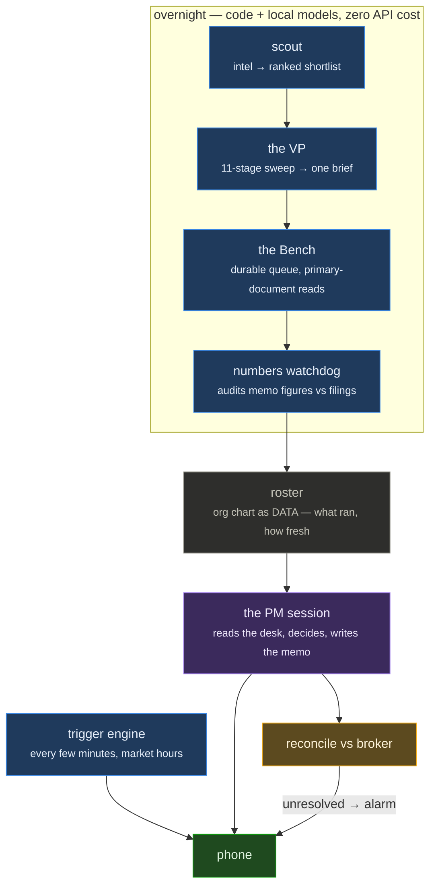

# The autonomous book

Alongside the research book — where every decision is a human's — a small carved-out
account is operated end-to-end by an agent under a written mandate. It exists to answer
one question: **does a process hold up when nobody is checking each step?**

_No positions, sizes or performance here; this is the operating design._

## Non-negotiables

These are enforced in code and in the mandate, not in the prompt's good intentions:

- A **written pre-trade memo before any order** — thesis, the mechanism, what would make
  it wrong, and the exit condition. No memo, no order.
- **Cash equities only.** No leverage, no derivatives, no margin.
- **Preview before place** on every order, and every decision journalled.
- **Post-session reconciliation** between what the agent believes it did and what the
  broker says happened, with an alarm on anything unresolved.
- The carve-out **does not loosen the rule on the research book**. The two never share a
  code path.

## The org-chart design

A portfolio manager session runs once a day. Everything that prepares its desk runs
overnight for free — plain code and local models, no API cost:

The reason the roster is **data rather than prose in a prompt**: prose goes stale and
nobody notices. Each row names the files that role reads and writes, so the system can
check the filesystem and tell the PM what actually ran and how fresh its output is. A role
whose output is missing shows up as missing, without anyone remembering to update a
document.

The reason the expensive session is last: context spent gathering is context not spent
deciding. By the time the PM opens, the shortlist is ranked, the filings are read, the
figures in every memo have been audited against the source, and the brief is one file.

## What is deliberately *not* automated

- **Funding decisions.** The account size is set by a human, and the drawdown alarm reports
  to a human rather than de-risking on its own.
- **The research book.** Every buy and sell there is a human's, permanently.
- **Anything the trigger engine can't express as arithmetic.** If waking someone up
  requires a model's opinion, it is not an alert; it is a note for the morning.

_Last updated August 2026._
