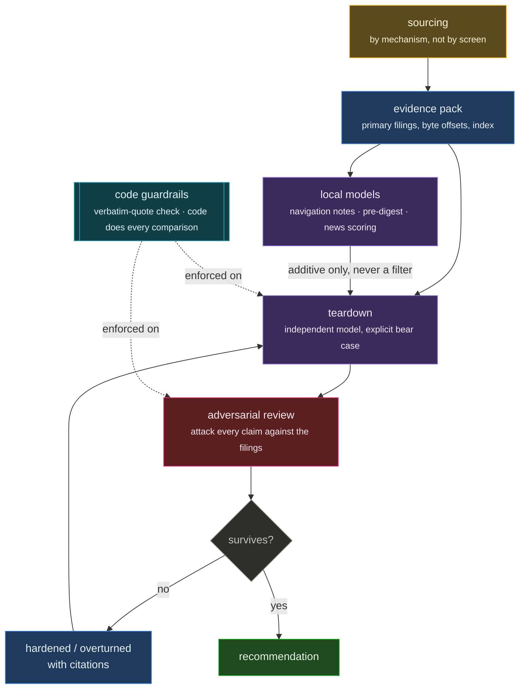
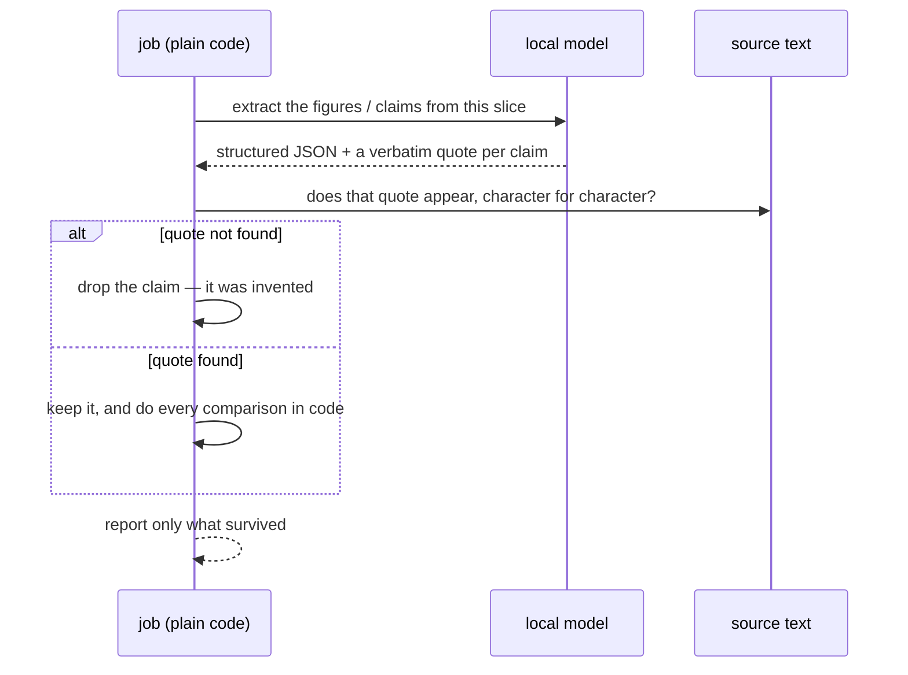

# Research Engine

An equity research pipeline built around one idea: **a claim that has not survived an
attack is not evidence.**

Every deep teardown this engine produces is handed to an independent adversarial verifier
whose job is to refute it — against the primary documents, not the analyst's notes — before
any recommendation is allowed to stand.

_Public overview of a private project. Method and architecture only; no positions, no
holdings, no numbers._

## Why adversarial verification

A single research pass produces confident prose. Confidence is not accuracy, and the
failure mode is specific: an analysis that is 90% right, where the wrong 10% is load-bearing.

The refuter is a separate pass with a different instruction — attack each claim, cite the
filing, and mark it overturned, hardened, or unchanged. Across the runs to date it has
consistently done real work rather than rubber-stamping:

- It overturned a **cash figure the analysis had computed itself**, because the company's
  own filing defined the measure differently — client float was sitting inside the cash
  line. Every valuation output moved.
- It caught a **definitional change between filings**: a segment metric quietly redefined
  from an inclusion list to an exclusion list, with no transition sentence, making a
  year-over-year growth rate incomparable to the one printed beside it.
- It found a **margin-bridge assumption that was 18 months stale** — management had
  updated the number on a recent call — which cut the modelled upside by two thirds and
  flipped the conclusion.
- It corrected an apples-to-oranges comparison in a compensation figure, a drawdown
  computed from the wrong high, and an insider-activity window that was off by years.

It also, more than once, **overturned claims that favoured the bear case** — which is the
signal that it is testing rather than agreeing with whoever wrote it.

## The pipeline

**Sourcing by mechanism, never by screen.** The question is always *who is selling for a
non-value reason* — forced index sales, spin-off orphans, complexity discounts,
post-deal share overhangs — not *what looks cheap on a multiple*.

**Evidence packs.** Filings are pulled from the regulator's primary source, sliced with
byte offsets, and indexed so an agent cites the document rather than its memory of it.
An early bug here is a good illustration of why primary sourcing matters: the fetcher
truncated filings at a fixed character count, silently dropping the later sections — and
the refuter caught the resulting error before anyone caught the truncation.

**Local models do the reading, never the deciding.** A GPU-resident model builds navigation
notes and pre-digests, and scores news for materiality — all of it *additive*. The rule is
absolute: local-model output is a navigation aid, never a filter on what the primary
analysis sees. A mis-scored item that disappears from the decision context is a research
error you cannot detect afterwards.

That rule was earned. When a candidate local model was benchmarked to replace the
incumbent, it fabricated five financial figures out of a document slice that contained
none — confidently, in the exact format the pipeline expected. It was rejected on the
spot, and every local model since is benchmarked with a grep-verifiable test: **every
figure it emits must appear verbatim in the text it was given.**

The guardrail that matters most, drawn as it actually runs — the model never gets to
assert a number, only to point at one:

## Guardrails enforced by code, not by prompt

- A claimed contradiction must carry a **verbatim quote that actually appears in the
  source**; code checks the string, and the claim is dropped if it doesn't.
- Extraction and comparison are **separated** — the model extracts figures, plain code
  does every comparison and every arithmetic step.
- A durable, resumable work queue for the long overnight reads, so a crash costs one item
  rather than a night.
- Reconciliation between what the system believes and what the account actually holds,
  after every session, with an alarm on any unresolved difference.

## Two books, one rule

The engine serves a research book where **every decision is a human's**, and a small
carve-out where an agent operates autonomously under a written mandate — pre-trade memo
before any order, preview before place, every decision journalled. The carve-out exists to
test whether the process holds when nobody is checking each step; it does not loosen the
rule on the main book, and the two never share a code path.

## The code

Four components in [`code/`](code/), copied verbatim: the valuation toolkit, the
terms-extraction pass with the verbatim-quote guardrail, the filing navigation indexer,
and the local news scorer. See [`code/README.md`](code/README.md).

## Stack

Python, the regulator's filing APIs, XBRL frames, local models for reading, frontier models
for judgment, and a dashboard for review. Scheduled jobs handle feeds, triggers, overnight
reading, and weekly digests.

_Last updated August 2026._
